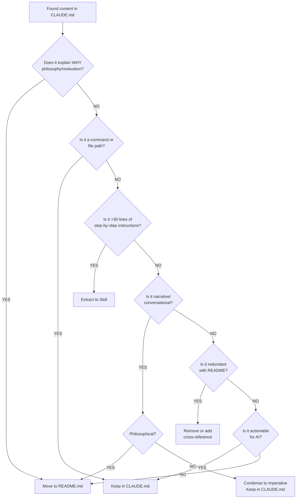

# Content Classification Decision Tree

Use this flowchart to determine where content belongs when refactoring CLAUDE.md.

## Decision Flowchart



## Question-Based Classification

Ask these questions in order:

### 1. Is this explaining WHY?

**Keywords**: "because", "philosophy", "we believe", "the reason is", "motivation", "rationale"

**Examples**:
- ✅ "We use TDD because it builds confidence" → README.md
- ✅ "This project prioritizes UX because users matter" → README.md
- ❌ "Run tests before committing" → Keep in CLAUDE.md

**Action**: Move to README.md under appropriate philosophy/design section

---

### 2. Is this a command, file path, or technical constraint?

**Examples**:
- ✅ `npm run test --workspace=frontend` → Keep
- ✅ `packages/frontend/src/main.ts` → Keep
- ✅ "Forms must support Enter to submit" → Keep
- ✅ "120 character line width" → Keep

**Action**: Keep in CLAUDE.md (AI needs this to execute tasks)

---

### 3. Is this >30 lines of step-by-step instructions?

**Indicators**:
- Multiple "Step 1", "Step 2", etc.
- Lengthy how-to guide
- Contains multiple code examples
- Requires supporting reference materials

**Examples**:
- ✅ "First-time CDK setup guide" (45 lines) → Extract to skill
- ✅ "TDD workflow with examples" (60 lines) → Extract to skill
- ❌ "Run tests: npm test" (3 lines) → Keep

**Action**: Extract to `.claude/skills/[topic-name]/SKILL.md`

---

### 4. Is this narrative or conversational?

**Keywords**: "you'll probably want to", "it's important to", "make sure you", "don't forget"

**Examples**:
- ✅ "You'll probably want to run tests frequently" → Condense or move
- ✅ "It's important to understand our architecture" → README.md
- ❌ "Run tests frequently" → Keep (concise directive)

**Action**:
- If philosophical → README.md
- If instructional → Condense to imperative form in CLAUDE.md

---

### 5. Is this redundant with README.md?

**Check**:
- Does README.md already explain this?
- Is this duplicated content?
- Could a cross-reference suffice?

**Examples**:
- ✅ Project description appears in both → Remove from CLAUDE.md, reference README
- ✅ Tech stack rationale in both → Remove from CLAUDE.md
- ❌ Unique technical detail → Keep in CLAUDE.md

**Action**: Remove from CLAUDE.md, optionally add "See README.md [section]"

---

### 6. Default: Is it actionable for AI?

If none of the above, ask:
- Can Claude Code use this to complete a task?
- Is it clear what action to take?
- Is it in imperative form?

**Examples**:
- ✅ "Use Svelte 5 runes: $state, $derived, $props" → Keep
- ✅ "Proxy API calls to /api" → Keep
- ❌ "We like TypeScript's type safety" → README.md

---

## Special Cases

### Case 1: Mixed Content (Philosophy + Instructions)

**Example**:
```markdown
We use pg-mem for in-memory PostgreSQL because it eliminates setup complexity.
To use it, configure database.config.ts with the pg-mem factory...
[20 more lines]
```

**Action**:
1. Split the content
2. Philosophy → README.md ("We use pg-mem because...")
3. Instructions → Keep concise in CLAUDE.md OR extract to skill if lengthy

---

### Case 2: Critical Context for AI

**Example**: Git hooks section explains "why custom directory" to help Claude understand when users have hook issues.

**Evaluation**:
- Is this explaining system behavior Claude will encounter? → Keep
- Is this explaining human workflow preferences? → README.md

**Rule**: If the context helps Claude debug or handle user issues, keep a concise version.

---

### Case 3: Commands with Narrative

**Example**:
```markdown
You can run tests in watch mode which is really helpful because it
re-runs tests automatically when you change files:
npm run test:watch
```

**Action**: Strip narrative, keep directive:
```markdown
**Watch mode**: `npm run test:watch` (re-runs on file changes)
```

---

## Quick Reference Table

| Content | Destination | Reason |
|---------|-------------|--------|
| "We believe..." | README.md | Philosophy |
| `npm run X` | CLAUDE.md | Command |
| "Step 1, Step 2... Step 10" (long) | Skill | Detailed how-to |
| `packages/frontend/src/` | CLAUDE.md | File path |
| "You'll want to..." | Condense → CLAUDE.md | Narrative tone |
| Project motivation | README.md | Human context |
| Technical constraint | CLAUDE.md | AI needs to follow |
| Duplicated overview | Remove → reference README | Redundant |
| Error troubleshooting (long) | Skill | Detailed reference |
| Keyboard shortcut | CLAUDE.md | Technical requirement |

---

## Common Patterns

### Pattern: "What vs Why vs How"

- **What** (facts, constraints) → CLAUDE.md
- **Why** (philosophy, motivation) → README.md
- **How** (detailed steps):
  - Short (<30 lines) → CLAUDE.md
  - Long (>30 lines) → Skill

### Pattern: "Tone Check"

**Conversational → README.md**:
- "This helps us..."
- "You'll probably..."
- "It's important that..."

**Imperative → CLAUDE.md**:
- "Use X"
- "Run Y"
- "Follow Z"

**Procedural → Skill**:
- "Step 1: ..."
- "If X, then Y"
- "Example: ..."

### Pattern: "Audience Test"

Read the content and ask:
- "Does this help Claude Code execute a task?" → CLAUDE.md
- "Does this help a developer understand the project?" → README.md
- "Does this teach Claude a complex workflow?" → Skill

---

## Edge Cases

### Edge Case 1: Brief Philosophy That Explains Constraints

**Example**: "We require keyboard accessibility because many users prefer it. All interactive features must support keyboard navigation."

**Solution**:
- First sentence → README.md
- Second sentence → CLAUDE.md (it's a technical requirement)

### Edge Case 2: Skill Reference with Context

**Keep in CLAUDE.md**:
```markdown
All features follow TDD workflow. See `.claude/skills/tdd-workflow/workflow.yaml`
```

**Why**: This tells Claude WHEN to use the skill (mandatory for features) and WHERE to find it.

### Edge Case 3: Configuration That Needs Explanation

**Example**: TypeScript configuration settings

**Solution**:
- Settings themselves → Keep in CLAUDE.md
- Why these settings were chosen → README.md (if important)
- Detailed configuration guide → Skill (if complex)

---

## Validation Checklist

After classification, verify:

- [ ] Content in CLAUDE.md uses imperative tone
- [ ] Content in README.md provides human context
- [ ] Skills contain step-by-step procedures
- [ ] No duplicate information across files
- [ ] Cross-references are accurate
- [ ] AI can execute tasks with CLAUDE.md alone
- [ ] Humans understand project with README.md alone