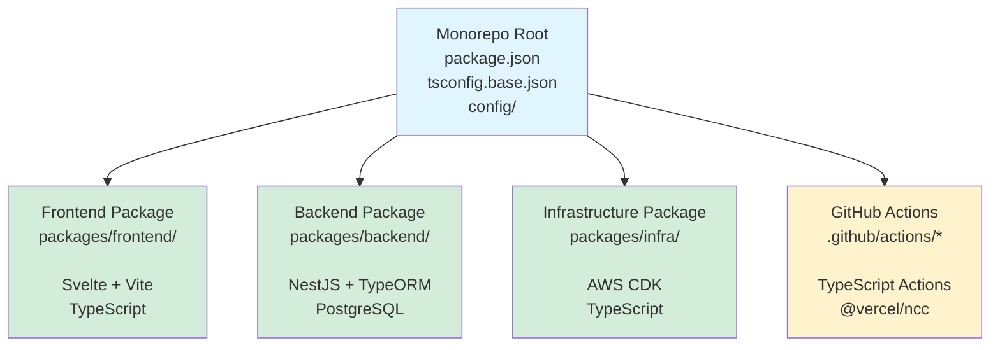
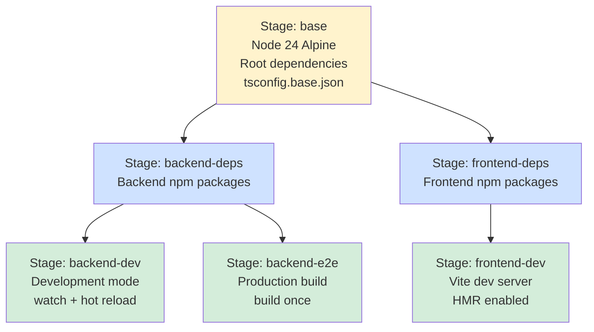

# Trip Settle

A full-stack TypeScript application for managing trip expense settlements.

## Features

✨ **Zero-configuration development** - No database installation needed
🚀 **Hot reload** - Fast development with Vite and NestJS watch mode
🎯 **Type-safe** - End-to-end TypeScript
🏗️ **Infrastructure as Code** - AWS CDK for deployments
📦 **Monorepo** - Organized with npm workspaces

## Tech Stack

- **Frontend**: Svelte + Vite + TypeScript
- **Backend**: NestJS + TypeORM + PostgreSQL
- **Infrastructure**: AWS CDK
- **Monorepo**: npm workspaces
- **Development Database**: pg-mem (in-memory PostgreSQL, zero configuration)
- **Testing**: Vitest (unit), Playwright (E2E)

## Architecture & Technical Decisions

This project showcases full-stack development with a focus on **developer experience (DX)** and modern engineering practices. Key architectural decisions demonstrate understanding of monorepo organization, build tooling, infrastructure automation, and team productivity.

### Monorepo Architecture

**npm workspaces** manage four workspace members (frontend, backend, infra, GitHub Actions) with unified tooling, providing a cohesive development experience across the full stack and CI/CD infrastructure.

#### Package Structure

The monorepo organizes code into four workspace members, each with its own responsibilities:



#### Key Architecture Benefits

**Shared configuration eliminates duplication:**
- Root-level ESLint/Prettier/TypeScript configs used by all packages
- Single source of truth for code quality rules
- Changes apply instantly across the entire monorepo

**Unified CI/CD pipeline:**
- Single pipeline builds and tests all packages in parallel (7-8 min total)
- Atomic deployments ensure frontend/backend changes deployed together
- No coordination between separate repositories

**Dependency deduplication:**
- Common dependencies hoisted to root, reducing `node_modules` size by ~40%
- Root dependencies: `typescript`, `eslint`, `prettier`, `@types/node`
- Package-specific dependencies stay isolated in their workspace

**GitHub Actions as workspace members:**
- Custom actions written in TypeScript, not bash/Node.js scripts
- Integrated into npm workspaces (`.github/actions/*`)
- Shared dependencies with main packages (saves ~400MB)
- Full type safety with `@actions/core` and `@actions/github`
- Unified build/lint/format commands across all workspaces

**Actions**: `check-snapshot-trigger`, `extract-e2e-failures`, `generate-failure-report`

**DX benefit**: Developers work across the full stack without switching repositories or dealing with version drift. CI tooling benefits from the same monorepo advantages as application code.

### Modern Build Tooling

**Vite + ESM-first architecture** for fast development cycles:

- **Sub-second HMR**: Changes reflect instantly without full page reloads
- **Native ES modules**: No bundler during development (Vite serves modules directly)
- **Optimized production builds**: Code splitting and tree shaking out of the box
- **TypeScript-first**: No Babel complexity, direct TS → JS via esbuild

**Migration impact**: Moved from ts-node to tsx for **2.7x performance boost** in infrastructure builds.

**DX benefit**: Instant feedback loop during development. No waiting for bundler rebuilds.

### Zero-Configuration Development

**pg-mem** provides in-memory PostgreSQL with zero setup:

- **No installation**: No PostgreSQL, Docker, or database tools required
- **Instant startup**: Backend starts in < 2 seconds with full database support
- **Full compatibility**: Real PostgreSQL syntax, not a mock (perfect for TypeScript ORMs)
- **Ephemeral data**: Clean state on every restart, ideal for development

**TypeScript-based configuration** eliminates `.env` files:

- **Compile-time validation**: Configuration errors caught during build, not runtime
- **IDE autocomplete**: Full IntelliSense for all config values
- **Environment clarity**: Explicit `local.ts`, `development.ts`, `production.ts` files
- **No secret leaks**: Environment-specific values injected by CI/CD, not committed

**DX benefit**: `npm install && npm run dev` is all you need. No README checklist of dependencies to install.

### CI/CD Optimizations

**Parallel execution strategy** reduces CI time by 40-50%:

- **4 jobs run concurrently**: Quality checks, build, unit tests, E2E tests
- **Smart dependencies**: E2E depends only on build, not quality (maximizes parallelism)
- **Docker layer caching**: 71% cache hit rate, 90% time savings vs cold builds
- **Base image caching**: Playwright image (786MB) cached, saves 46 seconds per build

**Total CI time**: ~7-8 minutes (would be 12-15 min sequential)

**Git notes for CI metadata** enable debugging without external tools:

- **Build cache metrics**: Track Docker layer performance over time
- **E2E failure analysis**: Automatically categorize test failures with stack traces
- **Snapshot update tracking**: Monitor visual regression workflow success/failure
- **Workflow timing metrics**: Job/step duration trends to identify bottlenecks

**DX benefit**: Fast feedback loops in CI. Rich diagnostic data embedded in git history, no external dashboards needed.

### Infrastructure as Code

**AWS CDK (Cloud Development Kit)** for type-safe infrastructure:

- **TypeScript infrastructure**: Define AWS resources with full IDE support
- **Compile-time validation**: Catch misconfigurations before deployment
- **Reusable constructs**: Abstract common patterns (VPC, RDS, CDN) into components
- **GitOps deployment**: Infrastructure changes deploy automatically on push to `main`

**OIDC authentication** for GitHub Actions (no stored AWS credentials):

- **Short-lived tokens**: GitHub generates temporary credentials via OIDC
- **No secret rotation**: No AWS access keys stored in GitHub Secrets
- **Audit trail**: CloudTrail logs show exactly what GitHub Actions deployed

**DX benefit**: Infrastructure changes are code changes. Review, version control, and deploy infrastructure like application code.

### Docker Parity (Local = CI)

**Identical environments** eliminate "works on my machine":

- **Same Docker images**: Local E2E tests use exact same Dockerfile as CI
- **Same browser versions**: Playwright image pinned (`v1.56.1-noble`) across all environments
- **Same OS rendering**: Visual snapshots generated in Linux container, not macOS/Windows

**Docker-based E2E testing** by default:

- **Zero setup**: No `npx playwright install --with-deps` needed
- **Service orchestration**: docker-compose starts backend + frontend + Playwright automatically
- **Isolation**: Tests don't pollute local environment

#### Multi-Stage Docker Build Architecture

The project uses a single `Dockerfile` with multiple build targets, optimized for CI/CD caching and layer reuse across services:



**Stage 1: Base (Shared by all services)**
- Node 24 Alpine + system dependencies (`dumb-init`)
- Root `package.json` + `tsconfig.base.json`
- Root npm dependencies (TypeScript, ESLint, Prettier)
- **Cached until**: Root `package.json` changes
- **Benefit**: Both frontend and backend reuse this layer

**Stage 2: Service Dependencies**
- `backend-deps`: Backend npm packages (NestJS, TypeORM, etc.)
- `frontend-deps`: Frontend npm packages (Svelte, Vite, etc.)
- Both inherit from `base` stage
- **Cached until**: Service `package.json` changes
- **Benefit**: Changes to frontend deps don't invalidate backend cache

**Stage 3: Runtime**
- `backend-dev`: NestJS watch mode (for local development)
- `backend-e2e`: NestJS build once (for E2E tests and production)
- `frontend-dev`: Vite dev server with HMR
- Copies application code (most volatile layer)
- **Rebuilt on**: Every code change

**Layer caching strategy:**
- Ordering: `base` → `*-deps` → `*-dev/e2e` (stable to volatile)
- **Result**: 71% cache hit rate, 90% time savings vs cold builds
- **Example**: Pushing backend code changes doesn't rebuild frontend dependencies

**Example CI behavior:**
1. Push changes to backend code only
2. CI pulls cached `base` stage (shared, unchanged)
3. CI pulls cached `frontend-deps` stage (unchanged)
4. CI rebuilds `backend-deps` and `backend-dev` (code changed)
5. Frontend build completes in ~30 seconds (fully cached)
6. Backend build completes in ~2 minutes (only deps + code rebuild)

**DX benefit**: E2E test failures in CI are reproducible locally. No debugging platform-specific rendering differences. Fast CI builds through aggressive layer caching.

### AI-Assisted Development

**Structured documentation** for AI pair programming:

- **CLAUDE.md**: AI-focused instructions (commands, file paths, technical constraints)
- **README.md**: Human-focused documentation (philosophy, architecture, setup)
- **Skills system**: Complex workflows (TDD, testing, CI debugging) packaged as reusable skills

**CI failure reports** optimized for Claude Code:

- **Structured markdown**: TypeScript errors grouped by file with line numbers
- **Git context**: Commit SHA, branch, run URL embedded in reports
- **Artifact uploads**: Downloadable reports for AI to analyze and suggest fixes

**DX benefit**: AI assistant has complete project context. Developers spend less time writing repetitive code, more time on architecture.

### Key Takeaways

These decisions demonstrate:

- **Systems thinking**: Optimizing the full development workflow, not just application code
- **Pragmatic automation**: Automate repetitive tasks (git hooks, CI caching, snapshot updates) while keeping manual control
- **Team scalability**: New developers productive in < 10 minutes (`npm install && npm run dev`)
- **Operational excellence**: Production infrastructure deployed with same rigor as application code

## Design Philosophy

Beyond technical architecture, this project demonstrates **product-focused engineering decisions** that balance user needs with implementation complexity.

### Keyboard-First Accessibility

**Decision**: All interactive features must work without a mouse.

**Engineering rationale**:
- **Accessibility requirement**: WCAG 2.1 compliance mandates keyboard navigation
- **Testability**: Keyboard interactions are easier to automate in E2E tests than mouse hover states
- **Mobile translation**: Touch gestures map more naturally to keyboard patterns than mouse events
- **Reduced complexity**: Single interaction model (keyboard) vs. dual models (keyboard + mouse)

**Implementation details**:
- Forms submit with Enter, clear with Escape (standard browser behavior)
- Tab navigation follows document flow (no custom tab index manipulation)
- Arrow keys for list navigation (minimal JavaScript, uses native focus management)
- Focus indicators styled with `:focus-visible` (only visible for keyboard users)

**Trade-off**: Requires more upfront planning of interaction patterns, but pays dividends in reduced edge cases.

### Mobile-First Responsive Design

**Decision**: Design for mobile viewport first, enhance for desktop.

**Engineering rationale**:
- **CSS simplicity**: Base styles are mobile styles; media queries only add complexity, never override
- **Performance constraint**: Mobile-first forces minimal DOM and CSS from the start
- **Testing priority**: Mobile viewports tested first (most users), desktop becomes the edge case
- **Progressive enhancement**: Features gracefully degrade on older/slower devices

**Implementation details**:
- Vite dev server tests mobile viewport by default
- Playwright tests run on mobile viewports first (iPhone, Pixel)
- CSS uses `min-width` media queries (never `max-width`)
- Touch targets sized for fingers (44×44px minimum)

**Trade-off**: Desktop-specific features (hover states, larger layouts) require explicit opt-in via media queries.

### Performance as Feature

**Decision**: Sub-second page loads and instant interactions.

**Engineering rationale**:
- **User retention metric**: Every 100ms delay reduces conversions by 1%
- **Accessibility requirement**: Fast response critical for cognitive disabilities
- **Technical constraint**: Vite HMR already provides instant feedback in development
- **Competitive advantage**: Speed differentiates commodity applications

**Implementation details**:
- Vite code splitting generates separate chunks per route
- Svelte compiles to vanilla JavaScript (no runtime framework overhead)
- pg-mem eliminates database round-trip latency in development
- Docker layer caching keeps CI feedback under 8 minutes

**Metrics**:
- Lighthouse performance score: 95+ (target)
- First Contentful Paint: < 1.5s
- Time to Interactive: < 2.5s
- Backend API response time: < 100ms (local development)

### Clear Visual Feedback

**Decision**: Every user action has immediate visual response.

**Engineering rationale**:
- **State management**: User needs confirmation that state changed
- **Error prevention**: Visual cues prevent accidental duplicate submissions
- **Debugging**: Clear UI states make bug reports more actionable
- **Trust building**: Responsive UI feels reliable, not broken

**Implementation details**:
- Button disabled states during async operations (prevents double-submit)
- Toast notifications for success/error feedback
- Loading spinners for operations > 200ms
- Form validation shows errors on blur (not on every keystroke)

**Trade-off**: More UI states to design and test, but drastically reduces "did it work?" support tickets.

### Testing Strategy

**Why Playwright for E2E Testing?**

Playwright catches UI breakage that unit tests miss:
- **Visual Regressions**: Screenshot comparisons detect layout shifts, CSS changes, missing elements
- **Functional Testing**: Verifies forms, buttons, navigation, and user workflows actually work
- **Keyboard Accessibility**: Ensures all features work without a mouse (critical for this project)
- **WCAG Compliance**: Automated accessibility audits catch contrast, ARIA, and semantic HTML issues

**Why Docker for E2E Tests?**

The project uses Docker-based Playwright testing by default for:
- ✅ **Zero setup**: No `npx playwright install` needed
- ✅ **Consistency**: Same browser versions on all machines (Mac, Linux, Windows)
- ✅ **CI/CD parity**: Identical environment to GitHub Actions
- ✅ **Isolation**: Tests don't affect local environment
- ✅ **Orchestration**: Automatically starts backend + frontend services

### Development Workflow

**Why Custom Git Hooks?**

By default, git hooks live in `.git/hooks/` which is **not tracked by version control**. Using a custom directory (`.githooks/`) provides:

1. **Version control hooks**: All team members get the same hooks
2. **Easy updates**: Hook changes propagate via git pull
3. **No external dependencies**: Works without tools like husky
4. **Explicit opt-in**: Developers consciously enable hooks after understanding what they do

**Why Git Notes for CI Metadata?**

The project uses git notes to store CI/CD metadata (cache metrics, test failures, workflow execution data) alongside commits. This approach provides several advantages:

1. **No external database needed**: Metadata lives in git itself, no additional infrastructure
2. **Version-controlled and auditable**: Track CI metrics over time with full git history
3. **Team-wide visibility**: Metadata pushed to remote is accessible to all team members
4. **Perfect for CI metadata**: Keeps diagnostic information attached to commits without polluting commit messages
5. **Enables trend analysis**: Historical data helps identify patterns (flaky tests, cache degradation, workflow timeouts)

Git notes are stored in separate namespaces:
- `refs/notes/ci/cache-metrics` - Docker build cache efficiency metrics
- `refs/notes/ci/e2e-failures` - Playwright E2E test failure metadata
- `refs/notes/ci/snapshot-updates` - Visual snapshot update workflow execution metadata
- `refs/notes/ci/workflow-metrics` - GitHub Actions job/step timing metrics

This metadata powers analysis skills that help diagnose CI failures quickly. For technical details on using git notes, see CLAUDE.md.

### Git Hooks

The project uses pre-commit hooks to validate code quality before commits. These hooks run automatically before each commit to check:

- Code formatting (Prettier)
- Linting (ESLint)
- Build compilation (all packages)

**Note**: E2E tests are NOT run in hooks due to slow execution time. Run them manually before pushing: `npm run test:e2e:docker`

#### Setting Up Git Hooks

After cloning the repository, enable custom hooks (one-time setup):

```bash
# Configure git to use the .githooks directory
git config core.hooksPath .githooks

# Make all hooks executable (required on Unix-based systems)
chmod +x .githooks/*
```

#### Verification

Verify hooks are configured correctly:

```bash
git config core.hooksPath
# Should output: .githooks
```

Try making a test commit - you should see the pre-commit hook output.

#### Bypassing Hooks Temporarily

If you need to bypass hooks for a specific commit (e.g., work-in-progress):

```bash
git commit --no-verify -m "WIP: Your message"
```

**Note**: Use `--no-verify` sparingly. It's better to fix issues caught by hooks than to bypass them.

For detailed troubleshooting and hook internals, see `.claude/skills/git-hooks-setup/SKILL.md`

**Why No .env Files?**

The project uses TypeScript-based configuration for:
- **Type safety**: Configuration errors caught at compile time
- **Better IDE support**: Autocomplete and refactoring
- **Environment clarity**: Explicit local/development/production configs
- **Zero secrets in repo**: Environment-specific values injected by CI/CD

## Quick Start

### Prerequisites

- Node.js >= 18
- npm >= 9
- AWS CLI (for infrastructure deployment, optional)

**Note**: No database installation required for local development!

### Installation & Development

```bash
# 1. Install dependencies
npm install

# 2. Start both frontend and backend
npm run dev
```

That's it! The development environment uses **pg-mem** for an in-memory PostgreSQL database with zero configuration.

- **Frontend**: http://localhost:5173
- **Backend**: http://localhost:3000
- **API**: http://localhost:3000/api

Or run them separately:
```bash
# Terminal 1 - Backend
npm run dev --workspace=backend

# Terminal 2 - Frontend
npm run dev --workspace=frontend
```

### Backend Run Modes

The backend supports two distinct run modes optimized for different contexts:

#### Development Mode (Watch)

**Command**: `npm run dev --workspace=backend`

**What it does**: TypeScript compilation in watch mode with hot reload. Code changes automatically trigger recompilation and restart.

**When to use**:
- Local native development
- Docker Compose local development (`docker-compose up`)
- Interactive debugging sessions

**Why**: Fast iteration during active development. No need to manually rebuild after each change.

#### Production Mode (Build Once)

**Commands**:
```bash
npm run build --workspace=backend
npm run start --workspace=backend
```

**What it does**: Builds TypeScript once to JavaScript, then runs the compiled code. No file watching.

**When to use**:
- CI/CD E2E tests (GitHub Actions)
- Production deployments (ECS, Lambda, Fargate)
- Docker E2E test environments

**Why**: Faster startup time, more stable for automated tests, no unnecessary file watching overhead in production.

#### Choosing the Right Mode

**For E2E Docker configurations** (`docker-compose.e2e.yml`, `Dockerfile`):
- **Local Docker E2E**: Use development mode for faster iteration when code changes need to be reflected immediately
- **CI E2E**: Use production mode for faster startup and stability in automated testing

### Database Setup

**Development**: No setup required! Uses `pg-mem` for in-memory PostgreSQL.

**Production**: Set environment variables:
```bash
NODE_ENV=production
DB_HOST=your-db-host
DB_PORT=5432
DB_USERNAME=postgres
DB_PASSWORD=your-password
DB_NAME=trip_settle
```

### API Endpoints

The backend exposes the following endpoints:

- `GET /api` - API root
- `GET /api/health` - Health check endpoint

Test the API:
```bash
curl http://localhost:3000/api
curl http://localhost:3000/api/health
```

### Building

```bash
# Build all packages
npm run build

# Build individual packages
npm run build --workspace=frontend
npm run build --workspace=backend
npm run build --workspace=infra
```

### Testing

```bash
# Run all tests
npm test

# Run unit tests for specific package
npm run test --workspace=frontend  # Vitest (Svelte components)
npm run test --workspace=backend   # Vitest (NestJS services)

# Run E2E tests (Docker-based, recommended)
npm run test:e2e:docker

# Run E2E tests locally (faster iteration during development)
npm run test:e2e:ui --workspace=frontend  # Interactive UI mode
```

**E2E Testing Philosophy**: The project uses Docker-based Playwright testing by default to ensure consistency across all development machines and CI/CD. Local testing is available for faster iteration when actively writing tests. See `.claude/skills/playwright-testing/guide.yaml` for comprehensive testing documentation.

### Continuous Integration (CI/CD)

The project uses GitHub Actions to automatically validate code changes. Every push and pull request triggers a comprehensive CI pipeline.

#### What Runs in CI

The CI workflow runs **4 jobs in parallel** for fast feedback:

1. **Code Quality** (~2 min) - Formatting, linting, type-checking
2. **Build** (~2 min) - Compiles all packages (frontend, backend, infra)
3. **Unit Tests** (~1 min) - Fast tests for frontend (Vitest) and backend (Vitest)
4. **E2E Tests** (~5-7 min) - End-to-end tests via Docker + Playwright

**Total CI time**: ~7-8 minutes (jobs run in parallel)

#### Running CI Checks Locally

**Before pushing**, run the same checks CI will run to avoid failures:

```bash
# Code quality (formatting, linting, type-checking)
npm run format:check && npm run lint && npm run type-check --workspace=frontend

# Build all packages
npm run build

# Unit tests (fast)
npm run test:unit --workspace=frontend  # Frontend unit tests
npm run test --workspace=backend        # Backend unit tests

# E2E tests (slower, run before push)
npm run test:e2e:docker  # Full E2E test suite with Docker
```

**Pre-commit hooks** automatically run formatting, linting, and build checks. See [Git Hooks](#git-hooks) section.

#### CI Optimizations

The CI pipeline is optimized for speed and efficiency:

- **Parallel execution**: Quality checks run concurrently with builds and tests
- **Docker layer caching**: GitHub Actions cache persists build layers across runs
- **Reduced browser matrix**: Tests run on 2 browsers (Chromium + WebKit) instead of 4
- **Optimized Dockerfile**: Layer ordering preserves npm cache when only code changes

**Performance gains**: 40-50% faster than sequential execution (~12-15 min → 7-8 min)

#### Docker Build Cache Metrics

CI automatically tracks Docker build efficiency with detailed metrics:

- **Cache hit rate**: Percentage of layers reused vs. rebuilt
- **Per-layer timing**: Identifies slow build steps
- **Build duration**: Tracks performance improvements over time

View metrics in the "e2e-tests" job summary after each CI run.

#### What to Do When CI Fails

1. **Check the job summary** - Click on the failed job to see details
2. **Download artifacts** - Failed builds/tests generate downloadable reports
3. **Run checks locally** - Reproduce the failure with local commands above
4. **See CI Failure Reports section below** for troubleshooting guidance

### CI Failure Reports

When GitHub Actions workflows fail, downloadable reports are automatically generated to help diagnose issues. These reports are optimized for both human developers and AI assistants like Claude Code.

#### Available Reports

**Build Failures** (`ci-failure-report.md`):
- Aggregates TypeScript compilation errors
- Groups errors by file with line numbers
- Includes error codes and messages
- Available as a downloadable artifact

**E2E Test Failures** (Playwright reports):
- HTML test report with screenshots
- Test results with stack traces
- Visual diff images for failed tests

#### How to Access Reports

1. **GitHub Actions UI**:
   - Go to the failed workflow run
   - Scroll to bottom → "Artifacts" section
   - Download `ci-failure-report` (build errors) or `playwright-report` (E2E failures)

2. **Job Summary**:
   - The CI failure report is also displayed in the workflow job summary
   - Click on the "All Checks Passed" job to view inline

#### Using Reports with Claude Code

These reports are designed to be Claude Code-friendly:

```bash
# 1. Download the ci-failure-report.md artifact from GitHub Actions
# 2. In Claude Code, share the report:
"Here's my CI failure report, can you help me fix it?"
# 3. Attach the ci-failure-report.md file

# Claude Code will analyze the errors and suggest fixes
```

#### What Gets Captured

The CI workflow captures failure information using several techniques:

- **Build logs**: Uses `tee` command to capture output while displaying it real-time
  ```bash
  npm run build 2>&1 | tee build-log.txt
  ```
  - `2>&1` redirects stderr to stdout (combines all output)
  - `tee` writes to both file and terminal simultaneously
  - Logs are uploaded as artifacts on failure

- **Test reports**: Playwright automatically generates HTML reports
- **Summary generation**: Node.js script parses logs and creates structured markdown

#### Technical Details

**How `tee` Works**:
The `tee` command is like a T-shaped pipe fitting - it duplicates input to multiple destinations:
- Writes output to a file (`build-log.txt`)
- Also prints to stdout (visible in GitHub Actions UI)
- This ensures you get both real-time logs AND saved artifacts

**Failure Report Script**: `.github/scripts/generate-failure-report.js`
- Parses TypeScript errors using regex patterns
- Groups errors by file for easy navigation
- Includes git context (commit SHA, branch, run URL)
- Runs only when failures are detected

### Deploying Infrastructure

#### First-Time Setup: Bootstrap AWS CDK (One-Time Operation)

Before deploying any infrastructure, you must bootstrap AWS CDK. This is a one-time operation per AWS account/region.

**Using AWS CloudShell (Recommended - No Local Credentials Needed):**

1. Log into AWS Console
2. Open CloudShell (terminal icon in top navigation bar)
3. Select your target region (e.g., `ap-northeast-2`)
4. Get your AWS account ID and region:

```bash
# Get account ID
aws sts get-caller-identity --query Account --output text

# Get current region
aws configure get region
```

5. Bootstrap CDK with your account ID and region:

```bash
# Replace with your account ID and desired region
npx cdk bootstrap aws://YOUR_ACCOUNT_ID/YOUR_REGION

# Example:
# npx cdk bootstrap aws://433751222689/ap-northeast-2
```

6. Verify bootstrap succeeded:

```bash
aws cloudformation describe-stacks --stack-name CDKToolkit
```

You should see the CDKToolkit stack with `StackStatus: CREATE_COMPLETE`.

**What does bootstrap do?**
- Creates S3 bucket for CloudFormation templates
- Creates ECR repository for Docker images
- Creates IAM roles for deployments
- One-time operation per account/region combination

#### Setting Up GitHub Actions for Continuous Deployment

To enable automatic deployments when you push to `main`, set up GitHub Actions OIDC (no AWS credentials stored in GitHub!):

> **💡 Need help?** If you're using [Claude Code](https://claude.com/claude-code), you can ask Claude to guide you through this setup process interactively. Simply say: *"Help me set up AWS CDK deployment using the cdk-setup skill"*. Claude will invoke the skill automatically and walk you through each step with explanations.

**1. Create OIDC Provider in AWS CloudShell:**

```bash
aws iam create-open-id-connect-provider \
  --url https://token.actions.githubusercontent.com \
  --client-id-list sts.amazonaws.com \
  --thumbprint-list 6938fd4d98bab03faadb97b34396831e3780aea1
```

**What is the thumbprint?** It's the SHA-1 fingerprint of GitHub's root certificate authority. AWS uses this to verify GitHub's TLS certificate when validating OIDC tokens. This value is public and stable. If you get an error that the provider already exists, skip this step.

**2. Create IAM Role for GitHub Actions:**

```bash
# Create trust policy file
cat > trust-policy.json <<'EOF'
{
  "Version": "2012-10-17",
  "Statement": [
    {
      "Effect": "Allow",
      "Principal": {
        "Federated": "arn:aws:iam::YOUR_ACCOUNT_ID:oidc-provider/token.actions.githubusercontent.com"
      },
      "Action": "sts:AssumeRoleWithWebIdentity",
      "Condition": {
        "StringEquals": {
          "token.actions.githubusercontent.com:aud": "sts.amazonaws.com"
        },
        "StringLike": {
          "token.actions.githubusercontent.com:sub": "repo:YOUR_GITHUB_USERNAME/trip-settle:*"
        }
      }
    }
  ]
}
EOF

# Replace YOUR_ACCOUNT_ID and YOUR_GITHUB_USERNAME in the file above

# Create the role
aws iam create-role \
  --role-name GitHubActionsCDKDeployRole \
  --assume-role-policy-document file://trust-policy.json

# Attach permissions (use AdministratorAccess for initial setup)
aws iam attach-role-policy \
  --role-name GitHubActionsCDKDeployRole \
  --policy-arn arn:aws:iam::aws:policy/AdministratorAccess

# Get the role ARN (save this for GitHub secrets)
aws iam get-role --role-name GitHubActionsCDKDeployRole --query 'Role.Arn' --output text
```

**3. Add GitHub Repository Variables:**

Go to your GitHub repository → Settings → Secrets and variables → Actions → Variables tab → **Repository variables** section, and add:
- `AWS_ROLE_ARN`: The role ARN from step 2 (e.g., `arn:aws:iam::433751222689:role/GitHubActionsCDKDeployRole`)
- `AWS_REGION`: Your AWS region (e.g., `ap-northeast-2`)

**Notes**:
- Use **Variables** (not Secrets) for the role ARN since it's a public identifier, not a credential. This makes debugging easier as the ARN will be visible in workflow logs.
- Use **Repository variables** (not Environment variables) since this project uses a single AWS account for all environments. If you plan to use separate AWS accounts per environment (e.g., staging, production), use Environment variables instead to configure different role ARNs per environment.

**Security Note**: For production, replace `AdministratorAccess` with a least-privilege policy containing only the permissions needed for your infrastructure (CloudFormation, S3, EC2, RDS, etc.).

#### Deploying Changes

After setup, deployments happen automatically via GitHub Actions when you push to `main`. No local AWS credentials needed!

For manual deployment (requires AWS credentials):
```bash
# Preview changes
npm run diff --workspace=infra

# Deploy to AWS
npm run deploy --workspace=infra
```

## Project Structure

```
trip-settle/
├── packages/
│   ├── frontend/          # Svelte application
│   │   ├── src/
│   │   └── vite.config.ts
│   ├── backend/           # NestJS API
│   │   ├── src/
│   │   └── nest-cli.json
│   └── infra/             # AWS CDK
│       ├── bin/
│       └── lib/
├── CLAUDE.md              # Claude Code documentation
└── package.json           # Root workspace config
```

## License

MIT
