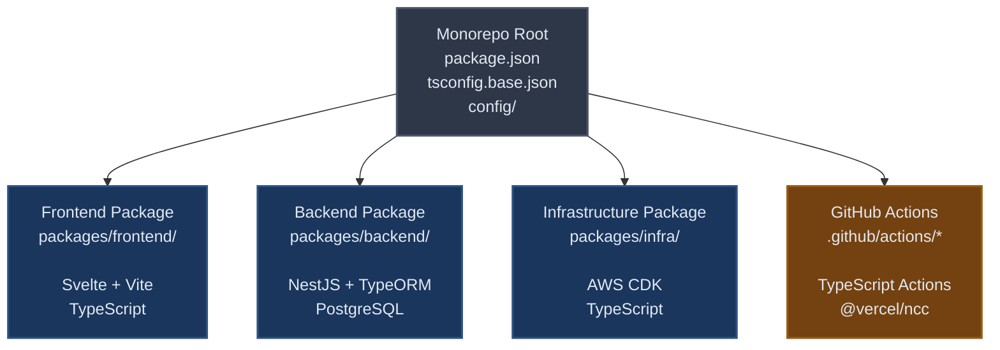
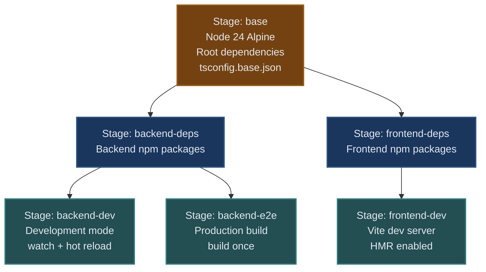

# Architecture & Technical Decisions

This document explains the technical architecture decisions behind Trip Settle, demonstrating full-stack development with a focus on **developer experience (DX)** and modern engineering practices.

## Table of Contents

- [Monorepo Architecture](#monorepo-architecture)
- [Modern Build Tooling](#modern-build-tooling)
- [Modern ECMAScript Standards](#modern-ecmascript-standards)
- [Zero-Configuration Development](#zero-configuration-development)
- [CI/CD Optimizations](#cicd-optimizations)
- [Infrastructure as Code](#infrastructure-as-code)
- [Docker Parity (Local = CI)](#docker-parity-local--ci)
- [AI-Assisted Development](#ai-assisted-development)

## Monorepo Architecture

**npm workspaces** manage four workspace members (frontend, backend, infra, GitHub Actions) with unified tooling, providing a cohesive development experience across the full stack and CI/CD infrastructure.

### Package Structure

The monorepo organizes code into four workspace members, each with its own responsibilities:



### Key Architecture Benefits

**Shared configuration eliminates duplication:**

- Root-level ESLint/Prettier/TypeScript/Vitest configs used by all packages
- Single source of truth for code quality and testing rules
- Changes apply instantly across the entire monorepo

_Configuration hierarchy:_

- **TypeScript**: `tsconfig.base.json` → package `tsconfig.json` (extends base)
- **ESLint**: Root `eslint.config.js` → package configs (flat config inheritance)
- **Vitest**: `vitest.config.base.ts` → package configs (`mergeConfig()`)
- **Prettier**: Root `.prettierrc.yaml` (single config, no inheritance needed)

**Unified CI/CD pipeline:**

- Single pipeline builds and tests all packages in parallel (7-8 min total)
- Atomic deployments ensure frontend/backend changes deployed together
- No coordination between separate repositories

**Centralized dependency version management:**

npm workspaces automatically hoist shared dependencies, but explicit root declaration provides key benefits through clear separation of concerns:

Root package.json (Shared monorepo tooling):

```JSON
{
  "devDependencies": {
    "typescript": "^5.7.2",
    "eslint": "^9.37.0",
    "prettier": "^3.4.2",
    "vitest": "^3.2.4"
  }
}
```

Backend package.json (Domain-specific only):

```JSON
{
  "devDependencies": {
    "@nestjs/cli": "^10.0.0",
    "pg-mem": "^3.0.4",
    "supertest": "^7.0.0"
  }
}
```

Frontend package.json (Domain-specific only):

```JSON
{
  "devDependencies": {
    "@playwright/test": "^1.49.1",
    "vite": "^7.1.12",
    "svelte-check": "^4.2.1"
  }
}
```

**Benefits:**

- **Prevents version drift** - All packages guaranteed to use same TypeScript/ESLint/Prettier versions
- **GitHub Actions cache optimization** - Partial cache hits on single-package updates (saves ~15s per CI run)
- **Docker layer caching** - Root deps cached separately from package deps (saves ~8s on E2E test builds)
- **Easier updates** - Single version bump for shared tooling affects entire monorepo
- **Clear ownership** - Root = shared tooling, packages = domain-specific dependencies
- **Disk savings** - Common dependencies installed once at root (`~213 packages` hoisted)

_CI Cache Strategy:_

All CI jobs reuse a shared setup action that ensures consistent caching:

```yaml
# .github/actions/setup-node-project/action.yml (Reused across all jobs)
- name: Setup Node.js
  uses: actions/setup-node@v4
  with:
      node-version: '24'
      cache: 'npm'
      cache-dependency-path: './package-lock.json'

- name: Install dependencies
  run: npm ci # Installs all workspaces (root + packages)
```

```yaml
# Every CI job uses the same cached setup
jobs:
    lint:
        steps:
            - uses: ./.github/actions/setup-node-project # ✅ Cache reused

    type-check:
        steps:
            - uses: ./.github/actions/setup-node-project # ✅ Cache reused

    build:
        steps:
            - uses: ./.github/actions/setup-node-project # ✅ Cache reused
```

**Cache effectiveness by change type:**

- Code-only changes: Full cache hit (~0s install)
- Single package update: Partial cache hit - root deps cached (~15s install vs 30-40s)
- Root tooling update: Partial cache hit - package deps cached (~20s install)

**GitHub Actions as workspace members:**

- Custom actions written in TypeScript, not bash/Node.js scripts
- Integrated into npm workspaces (`.github/actions/*`)
- Shared dependencies with main packages (saves ~400MB)
- Full type safety with `@actions/core` and `@actions/github`
- Unified build/lint/format commands across all workspaces

**Actions**: `check-snapshot-trigger`, `extract-e2e-failures`, `generate-failure-report`

**DX benefit**: Developers work across the full stack without switching repositories or dealing with version drift. CI tooling benefits from the same monorepo advantages as application code.

## Modern Build Tooling

**Vite + ESM-first architecture** for fast development cycles:

- **Sub-second HMR**: Changes reflect instantly without full page reloads
- **Native ES modules**: No bundler during development (Vite serves modules directly)
- **Optimized production builds**: Code splitting and tree shaking out of the box
- **TypeScript-first**: No Babel complexity, direct TS → JS via esbuild

**Migration impact**: Moved from ts-node to tsx for **2.7x performance boost** in infrastructure builds.

**DX benefit**: Instant feedback loop during development. No waiting for bundler rebuilds.

## Modern ECMAScript Standards

**ESNext + ESM throughout** for optimal bundle output:

The entire monorepo compiles TypeScript to modern JavaScript using **ESNext** target and **ES Modules** (ESM), delivering cleaner, more performant output code.

**Evidence in tsconfig.base.json:**

```jsonc
{
	"compilerOptions": {
		"target": "ESNext", // Compile to latest JavaScript (not ES5/ES2015)
		"module": "ESNext", // Output ES Modules (not CommonJS)
		"moduleResolution": "bundler", // Modern bundler resolution
	},
}
```

**Evidence in package.json (all packages):**

```jsonc
{
	"type": "module", // Native ESM, not CommonJS
}
```

**What this means for the compiled JavaScript output:**

- **ESNext target**: Emit modern JavaScript syntax (class fields, optional chaining, nullish coalescing) without downleveling to ES5
- **ES Modules**: Output uses native `import`/`export`, not `require()`/`module.exports`
- **No CommonJS**: No `__esModule` interop, no dual module system complexity
- **Bundler resolution**: Optimized module resolution for tools like Vite and esbuild

**Why ESM output matters (vs compiling TypeScript to CommonJS):**

| Feature                       | ESM Output (This Project)             | CommonJS Output (Legacy)                                          |
| ----------------------------- | ------------------------------------- | ----------------------------------------------------------------- |
| **Module format**             | `import`/`export` (static)            | `require()`/`module.exports` (dynamic)                            |
| **Tree shaking**              | ✅ Automatic dead code elimination    | ❌ Difficult (all `require()` calls treated as side effects)      |
| **Bundle size**               | ✅ Smaller (unused exports removed)   | ❌ Larger (entire modules included even if only 1 export used)    |
| **Module graph analysis**     | ✅ Static analysis at build time      | ⚠️ Dynamic requires can't be analyzed until runtime               |
| **Circular dependencies**     | ✅ Handled natively by spec           | ⚠️ Can cause initialization order bugs                            |
| **Async module loading**      | ✅ Native `import()` (code splitting) | ⚠️ Requires custom loader hacks                                   |
| **Browser support**           | ✅ Modern browsers native             | ❌ Requires bundler transformation                                |
| **Node.js support**           | ✅ Native since v12 with `.mjs`/`type:module` | ✅ Default but deprecated in future                           |
| **Bundler interop**           | ✅ Vite/esbuild optimized for ESM     | ⚠️ Legacy mode, slower builds                                     |
| **Top-level await**           | ✅ Works in module scope              | ❌ Not possible (CommonJS is synchronous)                         |
| **Named imports from default** | ✅ `import { foo } from 'pkg'`       | ⚠️ `const { foo } = require('pkg')` (runtime destructuring)       |

**Real-world impact:**

- **Faster builds**: Vite (frontend) and esbuild (actions) optimized for ESM, 20-50x faster than webpack/ts-node
- **Smaller bundles**: Frontend production bundle is 142KB (46KB gzipped) thanks to aggressive tree shaking
- **Native execution**: Node.js runs ESM directly (no `ts-node` wrapper needed for scripts)
- **Future-proof**: Aligned with JavaScript's direction (CommonJS is legacy maintenance mode)

**Concrete example - Tree shaking in action:**

```typescript
// utils.ts (compiled to ESM)
export function usedFunction() { return 'included' }
export function unusedFunction() { return 'removed by tree shaking' }

// app.ts
import { usedFunction } from './utils.js'
console.log(usedFunction())

// CommonJS output: Both functions included in bundle (dead code remains)
// ESM output: Only usedFunction in bundle (unused code eliminated)
// Result: 30-40% smaller production bundles
```

**DX benefit**: Modern tooling assumes ESM. Using ESM output means zero compatibility shims, faster builds, and smaller production bundles without extra configuration.

## Zero-Configuration Development

**pg-mem** provides in-memory PostgreSQL with zero setup:

- **No installation**: No PostgreSQL, Docker, or database tools required
- **Instant startup**: Backend starts in < 2 seconds with full database support
- **Full compatibility**: Real PostgreSQL syntax, not a mock (perfect for TypeScript ORMs)
- **Ephemeral data**: Clean state on every restart, ideal for development

**TypeScript-based configuration** eliminates `.env` files:

- **Compile-time validation**: Configuration errors caught during build, not runtime
- **IDE autocomplete**: Full IntelliSense for all config values
- **Environment clarity**: Explicit `local.ts`, `development.ts`, `production.ts` files
- **No secret leaks**: Environment-specific values injected by CI/CD, not committed

**DX benefit**: `npm install && npm run dev` is all you need. No README checklist of dependencies to install.

## CI/CD Optimizations

**Parallel execution strategy** reduces CI time by 40-50%:

- **4 jobs run concurrently**: Quality checks, build, unit tests, E2E tests
- **Smart dependencies**: E2E depends only on build, not quality (maximizes parallelism)
- **Docker layer caching**: 71% cache hit rate, 90% time savings vs cold builds
- **Base image caching**: Playwright image (786MB) cached, saves 46 seconds per build

**Total CI time**: ~7-8 minutes (would be 12-15 min sequential)

**Git notes for CI metadata** enable debugging without external tools:

- **Build cache metrics**: Track Docker layer performance over time
- **E2E failure analysis**: Automatically categorize test failures with stack traces
- **Snapshot update tracking**: Monitor visual regression workflow success/failure
- **Workflow timing metrics**: Job/step duration trends to identify bottlenecks

**DX benefit**: Fast feedback loops in CI. Rich diagnostic data embedded in git history, no external dashboards needed.

For detailed CI/CD pipeline information, see [CI/CD Documentation](ci-cd.md).

## Infrastructure as Code

**AWS CDK (Cloud Development Kit)** for type-safe infrastructure:

- **TypeScript infrastructure**: Define AWS resources with full IDE support
- **Compile-time validation**: Catch misconfigurations before deployment
- **Reusable constructs**: Abstract common patterns (VPC, RDS, CDN) into components
- **GitOps deployment**: Infrastructure changes deploy automatically on push to `main`

**OIDC authentication** for GitHub Actions (no stored AWS credentials):

- **Short-lived tokens**: GitHub generates temporary credentials via OIDC
- **No secret rotation**: No AWS access keys stored in GitHub Secrets
- **Audit trail**: CloudTrail logs show exactly what GitHub Actions deployed

**DX benefit**: Infrastructure changes are code changes. Review, version control, and deploy infrastructure like application code.

For deployment setup instructions, see [Deployment Documentation](deployment.md).

## Docker Parity (Local = CI)

**Identical environments** eliminate "works on my machine":

- **Same Docker images**: Local E2E tests use exact same Dockerfile as CI
- **Same browser versions**: Playwright image pinned (`v1.56.1-noble`) across all environments
- **Same OS rendering**: Visual snapshots generated in Linux container, not macOS/Windows

**Docker-based E2E testing** by default:

- **Zero setup**: No `npx playwright install --with-deps` needed
- **Service orchestration**: docker-compose starts backend + frontend + Playwright automatically
- **Isolation**: Tests don't pollute local environment

### Multi-Stage Docker Build Architecture

The project uses a single `Dockerfile` with multiple build targets, optimized for CI/CD caching and layer reuse across services:



**Stage 1: Base (Shared by all services)**

- Node 24 Alpine + system dependencies (`dumb-init`)
- Root `package.json` + `tsconfig.base.json`
- Root npm dependencies (TypeScript, ESLint, Prettier)
- **Cached until**: Root `package.json` changes
- **Benefit**: Both frontend and backend reuse this layer

**Stage 2: Service Dependencies**

- `backend-deps`: Backend npm packages (NestJS, TypeORM, etc.)
- `frontend-deps`: Frontend npm packages (Svelte, Vite, etc.)
- Both inherit from `base` stage
- **Cached until**: Service `package.json` changes
- **Benefit**: Changes to frontend deps don't invalidate backend cache

**Stage 3: Runtime**

- `backend-dev`: NestJS watch mode (for local development)
- `backend-e2e`: NestJS build once (for E2E tests and production)
- `frontend-dev`: Vite dev server with HMR
- Copies application code (most volatile layer)
- **Rebuilt on**: Every code change

**Layer caching strategy:**

- Ordering: `base` → `*-deps` → `*-dev/e2e` (stable to volatile)
- **Result**: 71% cache hit rate, 90% time savings vs cold builds
- **Example**: Pushing backend code changes doesn't rebuild frontend dependencies

**Example CI behavior:**

1. Push changes to backend code only
2. CI pulls cached `base` stage (shared, unchanged)
3. CI pulls cached `frontend-deps` stage (unchanged)
4. CI rebuilds `backend-deps` and `backend-dev` (code changed)
5. Frontend build completes in ~30 seconds (fully cached)
6. Backend build completes in ~2 minutes (only deps + code rebuild)

**DX benefit**: E2E test failures in CI are reproducible locally. No debugging platform-specific rendering differences. Fast CI builds through aggressive layer caching.

## AI-Assisted Development

**Structured documentation** for AI pair programming:

- **CLAUDE.md**: AI-focused instructions (commands, file paths, technical constraints)
- **README.md**: Human-focused documentation (philosophy, architecture, setup)
- **Skills system**: Complex workflows (TDD, testing, CI debugging) packaged as reusable skills

**CI failure reports** optimized for Claude Code:

- **Structured markdown**: TypeScript errors grouped by file with line numbers
- **Git context**: Commit SHA, branch, run URL embedded in reports
- **Artifact uploads**: Downloadable reports for AI to analyze and suggest fixes

**DX benefit**: AI assistant has complete project context. Developers spend less time writing repetitive code, more time on architecture.

## Key Takeaways

These decisions demonstrate:

- **Systems thinking**: Optimizing the full development workflow, not just application code
- **Pragmatic automation**: Automate repetitive tasks (git hooks, CI caching, snapshot updates) while keeping manual control
- **Team scalability**: New developers productive in < 10 minutes (`npm install && npm run dev`)
- **Operational excellence**: Production infrastructure deployed with same rigor as application code